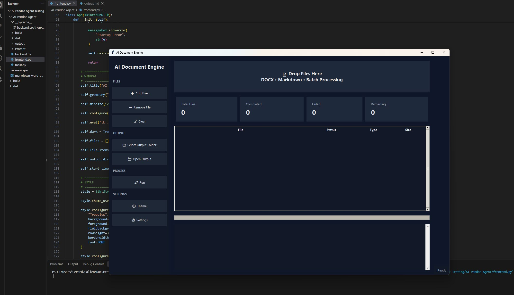

# AI Document Processing Engine

## Overview

The AI Document Processing Engine modernises Word-based documentation workflows.

## Problem

Technical writers often spend significant effort reformatting, updating, and modernising large document libraries.

## Solution

The engine converts Word documents to Markdown, applies AI-assisted improvements, and recreates high-quality Word output.

## Workflow
 

## Technologies Used

- Python
- Pandoc
- Markdown
- GitHub Copilot
- Azure OpenAI

## Benefits

- Faster document modernisation
- Consistent style
- Improved content quality
- Reusable Markdown source content

## Skills Demonstrated

- Technical Writing
- Information Architecture
- AI Prompt Engineering
- Process Automation
`
