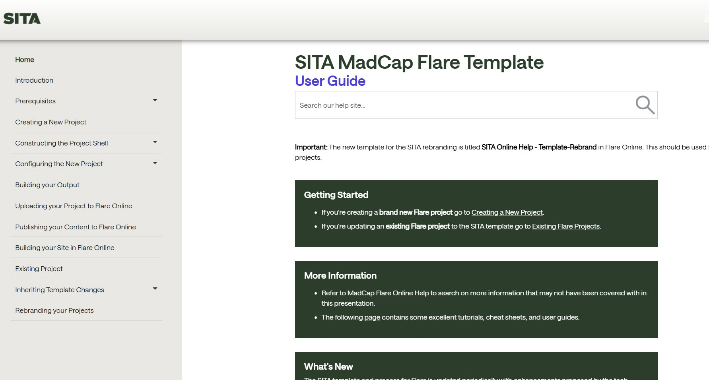
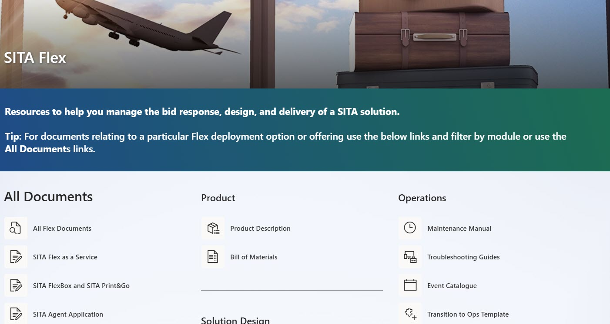

# Example Projects

## AI Document Processing Engine

The AI Document Processing Engine modernises Word-based documentation workflows by converting legacy authoring content into structured Markdown, applying AI-assisted improvements, and recreating polished Word outputs for downstream publishing.

This project is currently in the process of being integrated into the wider SITA Agentic toolkit. 

---

## MadCap Flare Administration

I act as the MadCap Flare Administrator for the technical writing team and also create and build online help packages. This role includes maintaining the HTML and PDF templates and assisting the team with issues in both Flare and Flare Online and keeping teams updated with tips and tricks via a Teams channel. 

---

## Toolkit Redesign
I created a new taxonomy and layout for the documents stored in the toolkits in SITA. This involved creating a modern page and retagging and reviewing documents across multiple products and modules. 

---
