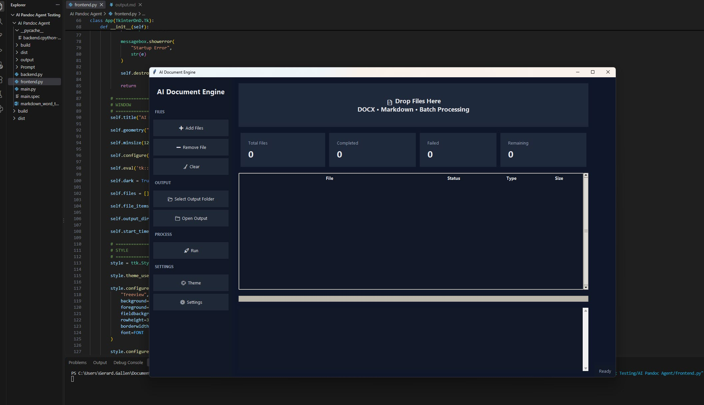

# SITA Sample Work & Deliverables

## AI Document Processing Engine

**Project Type:** Process automation, AI-assisted content transformation

### Overview

The AI Document Processing Engine modernises Word-based documentation workflows by converting legacy authoring content into structured Markdown, applying AI-assisted improvements, and recreating polished Word outputs for downstream publishing.

**Problem Solved:** Technical writers often spend significant effort reformatting, updating, and modernising large document libraries. This creates operational drag, slows release cycles, and makes content updates harder to sustain.

**Solution Delivered:** The engine converts Word documents to Markdown, applies AI-assisted improvements, and recreates high-quality Word output with more consistent structure and style.

### Workflow

### Deliverables

- Engine architecture and workflow documentation
- Python automation scripts and integration guides
- Markdown content templates and examples
- Word document output samples (before/after)
- Process documentation and best practices guide
- Impact metrics and case study documentation

### Technologies & Skills

**Tools Used:** Python, Pandoc, Markdown, GitHub Copilot, Azure OpenAI

**Skills Demonstrated:**
- Technical Writing
- Information Architecture
- AI Prompt Engineering
- Process Automation
- Content Modernisation

### Impact

- Faster document modernisation
- More consistent style and structure
- Improved content quality
- Reusable Markdown source content
- Reduced manual formatting effort

This project is currently in the process of being integrated into the wider SITA Agentic toolkit. 

---

## MadCap Flare Template and Documentation Governance

### Overview

I act as the MadCap Flare Administrator for the technical writing team and build online help packages. This role includes maintaining the HTML and PDF templates and assisting the team with issues in both Flare and Flare Online and keeping teams updated with tips and tricks via a Teams channel. 

**Project Type:** Documentation infrastructure, governance framework

### Deliverables
- Flare project template and onboarding guide
- Building HTML and PDF help
- Flare Online access management for SITA teams
- Migration of Word docs to Flare
- Conditioning for multiple outputs

### Tools & Technologies
MadCap Flare, XML, DITA principles, governance frameworks

---

## Documentation Quality and Team Growth

**Project Type:** Process improvement, team development

### Deliverables
- Quality improvement processes and checklists
- Documentation standards and style guide
- Writer onboarding program and materials
- Quality metrics and tracking documentation
- Knowledge-sharing guides and training
- Collaboration and review process documentation

### Tools & Technologies
Confluence, Jira, documentation standards, quality assurance practices

---

*Add links to sample documents, templates, or case studies here.*
